# Hospital Data Pipeline

An end-to-end ELT data pipeline that ingests hospital management data, transforms it through a modern data stack, and delivers actionable healthcare analytics — built with Python, AWS S3, Snowflake, dbt, Apache Airflow, and Power BI.

---

## Tech Stack


---

## Overview

### The Problem

A hospital generates data across multiple operational systems — patient records, doctor schedules, appointment bookings, billing transactions, and treatment logs. This data sits in **isolated CSV files** with no central analytics capability, making it impossible to answer critical business questions:

- What is the **no-show rate**, and which doctors or specializations are most affected?
- How much **revenue is outstanding** due to pending or failed payments?
- Which **treatment types** generate the most revenue?
- What does the **patient demographic** look like across age groups and insurance providers?

### The Solution

This project builds a **production-style ELT pipeline** that:

1. **Extracts** hospital data from Kaggle and lands it in AWS S3 as a raw data lake
2. **Loads** the data into Snowflake using external stages and automated table creation
3. **Transforms** it through three layers (staging → intermediate → marts) using dbt with data quality tests
4. **Orchestrates** the entire pipeline daily using Apache Airflow
5. **Visualizes** insights through a 4-page Power BI dashboard

The result is a **fully automated, tested, and documented data pipeline** that turns raw CSVs into healthcare analytics — refreshed daily with zero manual intervention.

---

## Architecture

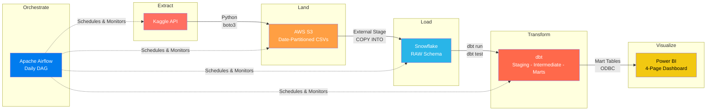

### Pipeline Flow

| Step | Layer | Tool | Description |
|------|-------|------|-------------|
| 1 | **Extract** | Python, Kaggle API | Download 5 CSV datasets from Kaggle |
| 2 | **Land** | AWS S3, boto3 | Upload to S3 with date-partitioned paths (`YYYYMMDD`) |
| 3 | **Load** | Snowflake | External stage + `COPY INTO` loads data into RAW schema |
| 4 | **Transform** | dbt | 3-layer transformation: staging (clean) → intermediate (join) → marts (model) |
| 5 | **Test** | dbt | Data quality tests: not_null, unique, accepted_values, relationships |
| 6 | **Orchestrate** | Airflow | Daily DAG automates steps 1–5 in sequence |
| 7 | **Visualize** | Power BI | 4-page dashboard connected to Snowflake mart tables via ODBC |

### Snowflake Schema (Medallion Pattern)

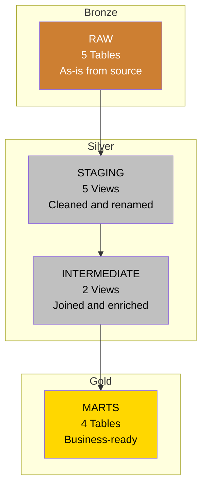

---

## Dataset

**Source:** [Hospital Management Dataset](https://www.kaggle.com/datasets/kanakbaghel/hospital-management-dataset) (Kaggle)

| Table | Records | Description |
|-------|---------|-------------|
| Patients | 50 | Patient demographics, contact info, insurance details |
| Doctors | 10 | Doctor profiles, specializations, years of experience |
| Appointments | 200 | Scheduled visits, statuses (Scheduled/Completed/Cancelled/No-show) |
| Billing | 200 | Payment records, methods (Insurance/Credit Card), statuses (Paid/Pending/Failed) |
| Treatments | 200 | Medical treatments, types (Chemotherapy/MRI/ECG), costs |

---

## Project Structure

```
hospital-data-pipeline/
├── ingestion/
│   └── ingest_kaggle_to_s3.py          # Kaggle → S3 ingestion script
├── loading/
│   └── load_s3_to_snowflake.sql        # COPY INTO statements for all tables
├── transformation/
│   └── hospital_dbt/                   # dbt project
│       ├── dbt_project.yml             # Project configuration
│       ├── profiles.yml                # Snowflake connection config
│       ├── macros/
│       │   └── generate_schema_name.sql # Custom schema naming macro
│       └── models/
│           ├── staging/                # 5 views — clean, cast, rename
│           │   ├── _stg_sources.yml    # Source definitions
│           │   ├── _stg_models.yml     # Tests for staging models
│           │   ├── stg_patients.sql
│           │   ├── stg_doctors.sql
│           │   ├── stg_appointments.sql
│           │   ├── stg_billing.sql
│           │   └── stg_treatments.sql
│           ├── intermediate/           # 2 views — join, enrich
│           │   ├── int_patient_appointments.sql
│           │   └── int_treatment_billing.sql
│           └── marts/                  # 4 tables — business-ready
│               ├── dim_patients.sql
│               ├── dim_doctors.sql
│               ├── fct_appointments.sql
│               └── fct_billing.sql
├── orchestration/
│   └── dags/
│       └── hospital_pipeline_dag.py    # Airflow DAG
├── docs/
│   └── images/                         # Screenshots and diagrams
├── .env.example                        # Environment variable template
├── .gitignore
├── requirements.txt
└── README.md
```

---

## Pipeline Details

### 1. Ingestion — Python to S3

A Python script downloads the hospital dataset from Kaggle and uploads CSVs to S3 with date-partitioned paths.

**Key features:**
- Kaggle API download via `subprocess` with exit code validation
- Automatic zip extraction using `zipfile`
- Date-partitioned S3 paths (`kaggle-ds/hospital-management-dataset/YYYYMMDD/`)
- File size logging for upload verification
- `try/finally` cleanup of temporary files
- Environment variable for bucket name

```
S3 Path Structure:
s3://uni-kcebuen/
└── kaggle-ds/
    └── hospital-management-dataset/
        └── 20260426/
            ├── appointments.csv
            ├── billing.csv
            ├── doctors.csv
            ├── patients.csv
            └── treatments.csv
```

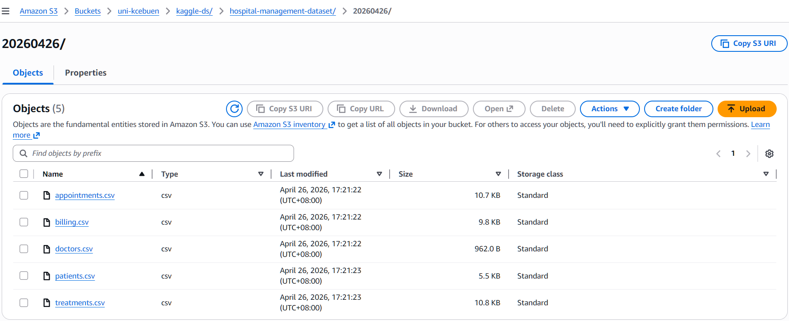

---

### 2. Loading — S3 to Snowflake

Data is loaded from S3 into Snowflake using an external stage, storage integration, and `COPY INTO` commands.

**Snowflake objects created:**

| Object | Purpose |
|--------|---------|
| `HOSPITAL_DB` | Main project database |
| `HOSPITAL_DB.RAW` | Raw data landing schema |
| `HOSPITAL_DS` (External Stage) | Points to S3 bucket via storage integration |
| `CSV_FF` (File Format) | `PARSE_HEADER = TRUE` — for schema inference |
| `CSV_FF_LOAD` (File Format) | `SKIP_HEADER = 1` — for data loading |
| Storage Integration | IAM role linking S3 to Snowflake securely |

**Reusable stored procedure: `GENERATE_DDL_FROM_STAGE`**

A custom stored procedure that automatically creates tables from any staged CSV files:
- Uses `INFER_SCHEMA` to detect column names and types from CSV headers
- Uses `USING TEMPLATE` to create tables directly from the inferred schema
- Loops through all files in a stage path via cursor
- Replaces hyphens with underscores in table names
- Fully reusable across any dataset or project

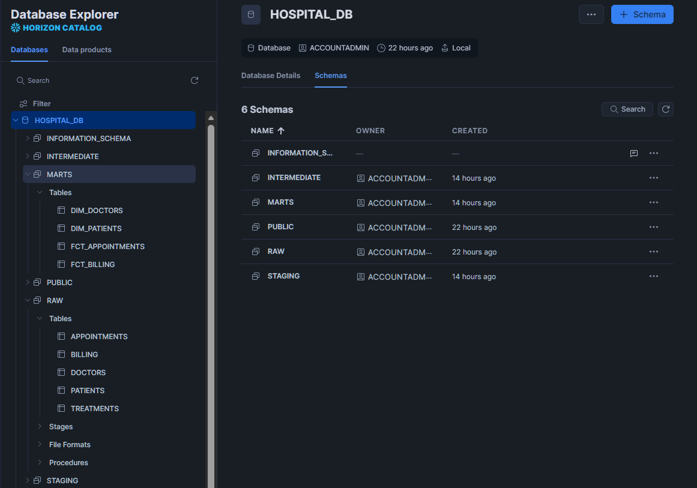

---

### 3. Transformation — dbt

dbt transforms raw data through three layers, following the **staging → intermediate → marts** pattern (equivalent to the medallion architecture: Bronze → Silver → Gold).

#### Staging Layer (5 Views)

Schema: `HOSPITAL_DB.STAGING`

| Model | Transformations |
|-------|----------------|
| `stg_patients` | Combined `full_name`, calculated `age` and `age_group`, normalized columns to uppercase |
| `stg_doctors` | Combined `full_name`, normalized columns to uppercase |
| `stg_appointments` | Combined `appointment_datetime` from date + time, normalized columns |
| `stg_billing` | Cast `amount` to NUMBER(10,2), normalized columns |
| `stg_treatments` | Cast `cost` to NUMBER(10,2), normalized columns |

#### Intermediate Layer (2 Views)

Schema: `HOSPITAL_DB.INTERMEDIATE`

| Model | Tables Joined | Purpose |
|-------|--------------|---------|
| `int_patient_appointments` | appointments + patients + doctors | Full appointment context with patient and doctor details |
| `int_treatment_billing` | treatments + billing + appointments | Treatment details with cost and payment information |

#### Marts Layer (4 Tables)

Schema: `HOSPITAL_DB.MARTS`

| Model | Type | Key Columns |
|-------|------|-------------|
| `dim_patients` | Dimension | full_name, age, age_group, gender, insurance_provider |
| `dim_doctors` | Dimension | full_name, specialization, years_experience, hospital_branch |
| `fct_appointments` | Fact | status, reason_for_visit, NO_SHOW flag, IS_CANCELLED flag |
| `fct_billing` | Fact | amount, payment_method, PAID_AMOUNT, PENDING_AMOUNT, FAILED_AMOUNT |

#### dbt Tests

| Test Type | Coverage |
|-----------|---------|
| `not_null` | All primary keys, email, amount, cost, insurance_provider, specialization |
| `unique` | All primary keys (patient_id, doctor_id, appointment_id, bill_id, treatment_id) |
| `accepted_values` | status (Scheduled/Completed/Cancelled/No-show), payment_status (Paid/Pending/Failed), gender (M/F) |
| `relationships` | appointments.patient_id → patients, appointments.doctor_id → doctors |

#### dbt Lineage

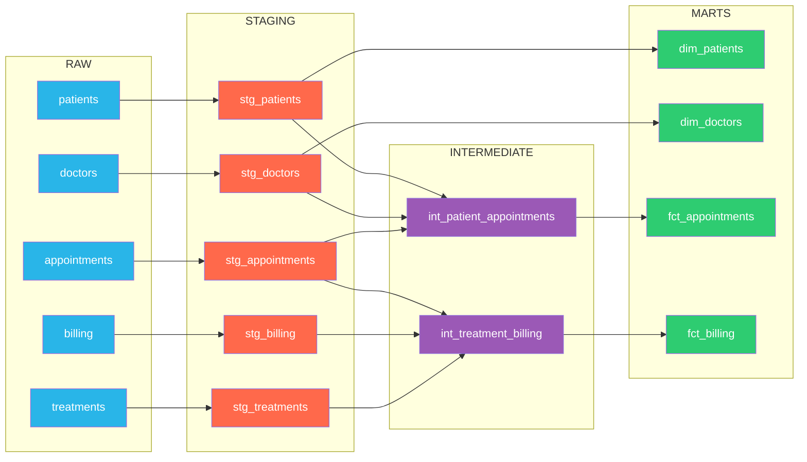

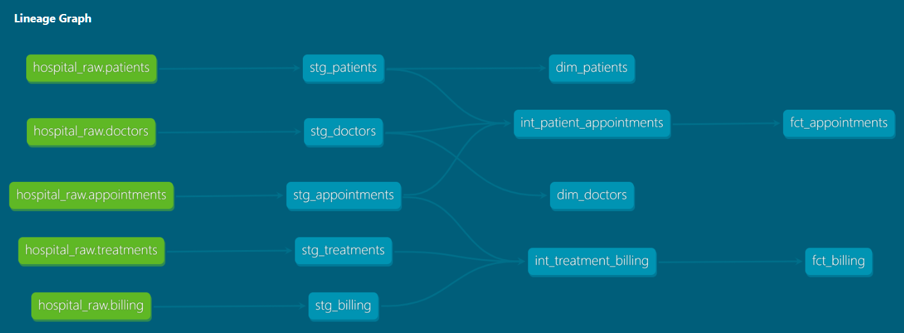

---

### 4. Orchestration — Apache Airflow

Apache Airflow automates the full pipeline with a daily scheduled DAG.

**DAG: `hospital_data_pipeline`**

| Property | Value |
|----------|-------|
| Schedule | `@daily` |
| Catchup | `False` |
| Retries | 1 |
| Retry Delay | 5 minutes |

**Task Flow:**


| Task | Operator | Description |
|------|----------|-------------|
| `ingest_kaggle_to_s3` | BashOperator | Runs Python script to download from Kaggle and upload to S3 |
| `load_s3_to_snowflake` | SQLExecuteQueryOperator | Executes COPY INTO for all 5 tables via Snowflake connection |
| `dbt_run` | BashOperator | Builds all dbt models (staging → intermediate → marts) |
| `dbt_test` | BashOperator | Runs data quality tests across all models |

**Security:** Snowflake credentials stored as Airflow connections and variables — no secrets in code.

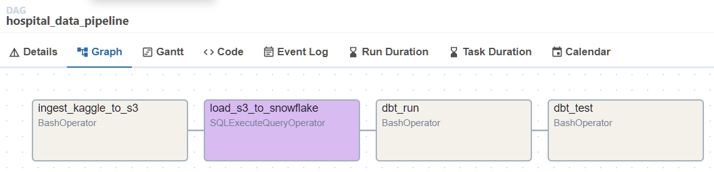

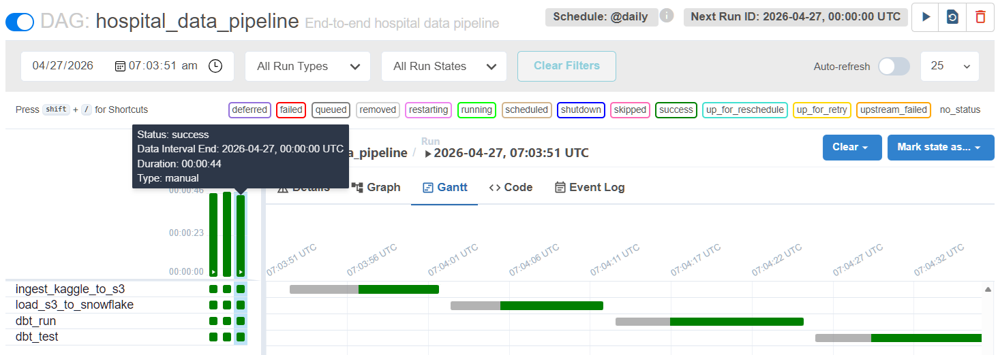

---

### 5. Visualization — Power BI

Power BI connects directly to Snowflake's mart tables via ODBC connector.

**Data Model:**

| Relationship | Cardinality |
|-------------|-------------|
| `FCT_APPOINTMENTS.PATIENT_ID` → `DIM_PATIENTS.PATIENT_ID` | Many to One |
| `FCT_APPOINTMENTS.DOCTOR_ID` → `DIM_DOCTORS.DOCTOR_ID` | Many to One |
| `FCT_BILLING.PATIENT_ID` → `DIM_PATIENTS.PATIENT_ID` | Many to One |

**DAX Measures:**
```
Outstanding Amount = SUM(FCT_BILLING[PENDING_AMOUNT]) + SUM(FCT_BILLING[FAILED_AMOUNT])
No-Show Rate = DIVIDE(SUM(FCT_APPOINTMENTS[NO_SHOW]), COUNTROWS(FCT_APPOINTMENTS), 0)
Total Appointments = COUNTROWS(FCT_APPOINTMENTS)
```

#### Page 1 — Overview
KPI cards: Total Appointments, Total Revenue, Outstanding Amount, No-Show Rate

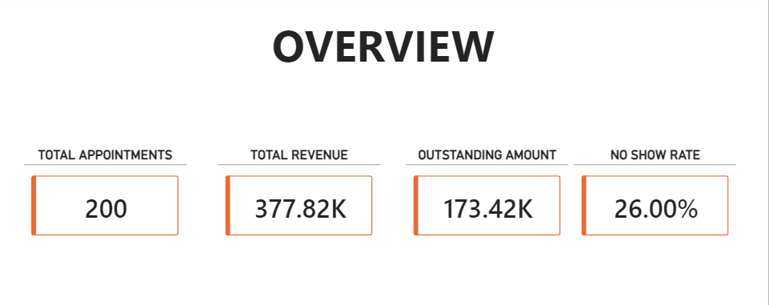

#### Page 2 — Appointments Analysis
Appointments by status, specialization, top doctors, and reason for visit

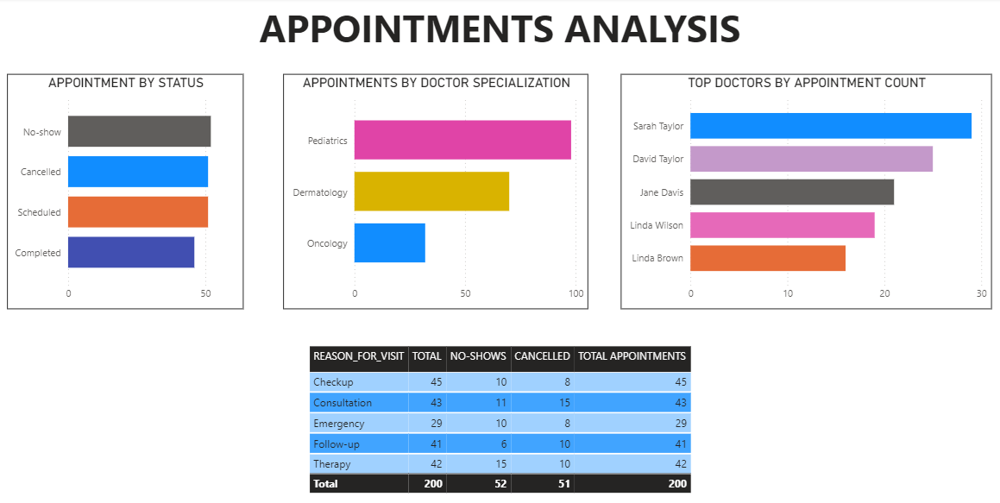

#### Page 3 — Financial Analysis
Revenue by treatment type, payment method distribution, revenue by doctor, payment status breakdown

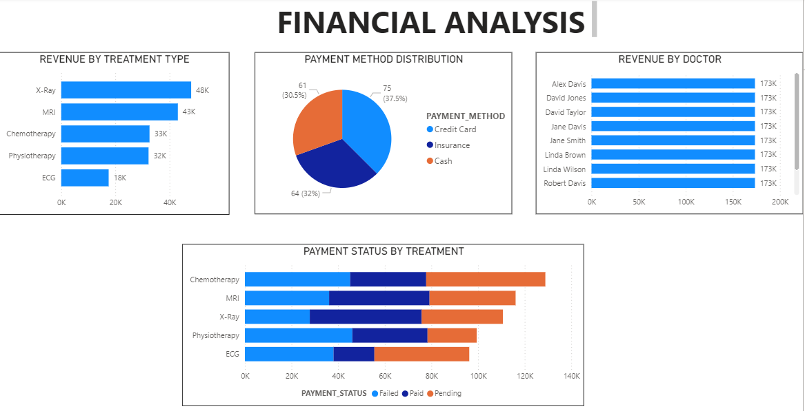

#### Page 4 — Patient Demographics
Patients by age group, gender distribution, insurance providers, top patients by billing

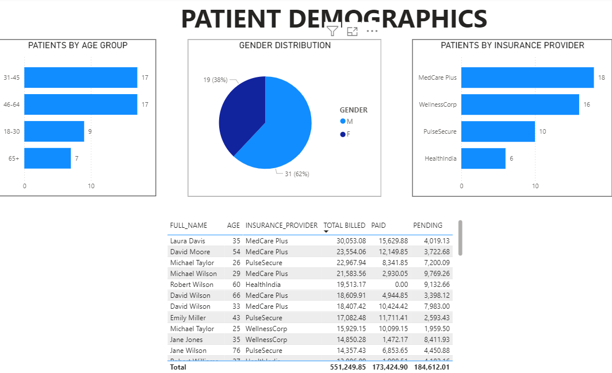

---

## Setup & Installation

### Prerequisites

| Tool | Version | Purpose |
|------|---------|---------|
| Python | 3.12+ | Ingestion script, dbt, Airflow |
| AWS Account | - | S3 bucket for raw data storage |
| Snowflake Account | - | Data warehouse |
| Kaggle Account | - | Dataset download API |
| Apache Airflow | 2.10.4 | Pipeline orchestration |
| Power BI Desktop | - | Dashboard visualization |

### Installation

```bash
# Clone the repository
git clone https://github.com/YOUR_USERNAME/hospital-data-pipeline.git
cd hospital-data-pipeline

# Create and activate virtual environment
python3 -m venv venv
source venv/bin/activate

# Install dependencies
pip install -r requirements.txt
```

### Configuration

**1. Environment variables:**
```bash
cp .env.example .env
# Edit .env and add your Snowflake password
```

**2. AWS credentials:**
```bash
aws configure
# Enter: Access Key ID, Secret Access Key, Region (e.g., us-west-2)
```

**3. Kaggle API:**
- Download `kaggle.json` from your Kaggle account settings
- Place it in `~/.kaggle/kaggle.json`
- Run `chmod 600 ~/.kaggle/kaggle.json`

**4. Snowflake:**
- Update `transformation/hospital_dbt/profiles.yml` with your account, user, role, database, and warehouse

**5. Airflow:**
```bash
# Initialize Airflow
export AIRFLOW_HOME=~/airflow
airflow db init

# Create admin user
airflow users create \
    --username admin \
    --firstname Admin \
    --lastname User \
    --role Admin \
    --email admin@example.com \
    --password admin

# Add Snowflake connection
airflow connections add 'snowflake_default' \
    --conn-type 'snowflake' \
    --conn-login 'YOUR_USER' \
    --conn-password 'YOUR_PASSWORD' \
    --conn-schema 'RAW' \
    --conn-extra '{"account": "YOUR_ACCOUNT", "warehouse": "COMPUTE_WH", "database": "HOSPITAL_DB", "role": "ACCOUNTADMIN"}'

# Store dbt password as Airflow variable
airflow variables set snowflake_password 'YOUR_PASSWORD'
```

### Run

```bash
# Load environment variables
set -a && source .env && set +a

# Run dbt manually
cd transformation/hospital_dbt
dbt run
dbt test

# Or trigger the full pipeline via Airflow
airflow dags trigger hospital_data_pipeline
```

---

## Challenges & Solutions

| # | Challenge | Root Cause | Solution |
|---|-----------|-----------|----------|
| 1 | `INFER_SCHEMA` created lowercase column names | Snowflake stores quoted identifiers as-is | Staging models alias all columns to uppercase |
| 2 | dbt schemas named `RAW_STAGING` instead of `STAGING` | dbt prepends default schema to custom schemas | Custom `generate_schema_name` macro (industry standard) |
| 3 | `COPY INTO` failed with `PARSE_HEADER` | `COPY INTO` does not support `PARSE_HEADER` | Created separate file formats for inference vs loading |
| 4 | Stored procedure created tables with date folder as name | `SPLIT_PART` extracted wrong path segment | Used `SPLIT_PART(..., '/', -1)` to grab last segment |
| 5 | Airflow 3.x CLI not working | Breaking changes in v3 entry point | Downgraded to stable Airflow 2.10.4 |
| 6 | `SnowflakeOperator` import error | Deprecated in newer provider versions | Migrated to `SQLExecuteQueryOperator` |
| 7 | AWS credentials not found in Airflow | Airflow runs in isolated environment | Configured `aws configure` in WSL + `~/.aws/credentials` |
| 8 | dbt not found when Airflow runs `dbt run` | dbt not installed in Airflow's virtual environment | Installed `dbt-snowflake` in same venv as Airflow |
| 9 | Special characters in password broke bash | `!@` interpreted by shell | Single quotes in bash, Airflow variables for secrets |
| 10 | Snowflake account locked during dbt setup | Multiple failed auth attempts with wrong account ID | Used `CURRENT_ORGANIZATION_NAME()` to find correct identifier |

---

---

## CI/CD Pipeline

Automated testing with GitHub Actions — runs on every push to `master` or pull request that modifies the `transformation/` directory.

### Workflow: `dbt_ci.yml`


| Trigger | Condition | Action |
|---------|-----------|--------|
| Push to `master` | Files changed in `transformation/` | Run `dbt build` + `dbt test` |
| Pull request to `master` | Files changed in `transformation/` | Run `dbt build` + `dbt test` |

**Security:** Snowflake credentials stored as GitHub repository secrets — never exposed in code or logs.

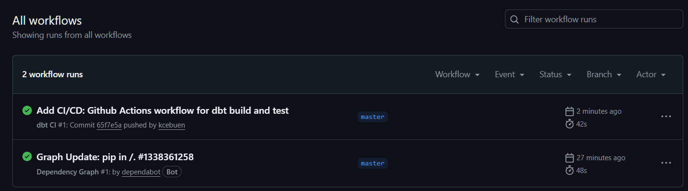

---

## What I Learned

### Data Engineering Concepts
- **ELT over ETL** — Loading raw data first and transforming inside the warehouse leverages Snowflake's compute power and keeps transformations auditable
- **Dimensional modeling** — Designing fact tables (events/transactions) and dimension tables (descriptive entities) for optimal analytics
- **Medallion architecture** — Organizing data into Bronze (raw), Silver (cleaned), and Gold (business-ready) layers

### Tools & Technologies
- **Snowflake** — External stages, storage integrations, `INFER_SCHEMA`, `USING TEMPLATE`, `COPY INTO`, file formats, stored procedures
- **dbt** — Source/ref functions, materialization strategies (view vs table), custom macros, data quality testing, lineage tracking
- **Airflow** — DAG design, operator selection (BashOperator, SQLExecuteQueryOperator), connection and variable management, task dependencies
- **Power BI** — Snowflake ODBC connection, data modeling with relationships, DAX measures, visual design
- **Github Actions** - CI/CD workflow configuration, secret management, automated dbt testing on push and pull request triggers

### Best Practices
- **Security** — No secrets in code; environment variables, Airflow variables, and AWS credential files
- **Modularity** — Each pipeline stage is independent and reusable
- **Testing** — Data quality tests at the transformation layer catch issues before they reach dashboards
- **Documentation** — Self-documenting code with dbt lineage and explicit column selection

---

## Future Improvements

- [x] **CI/CD** — GitHub Actions to run `dbt build` and `dbt test` on every pull request
- [ ] **Incremental models** — Convert mart tables to incremental materialization for larger datasets
- [ ] **dbt documentation** — Deploy dbt docs as a static site for interactive lineage exploration
- [ ] **Airflow alerts** — Email or Slack notifications on task failure
- [ ] **Data freshness** — dbt source freshness checks to detect stale data
- [ ] **Additional data sources** — Integrate more hospital systems (pharmacy, lab results, insurance claims)
- [ ] **Row-level security** — Snowflake row access policies for multi-branch data access
- [ ] **Cost monitoring** — Snowflake warehouse usage tracking and auto-suspend optimization
